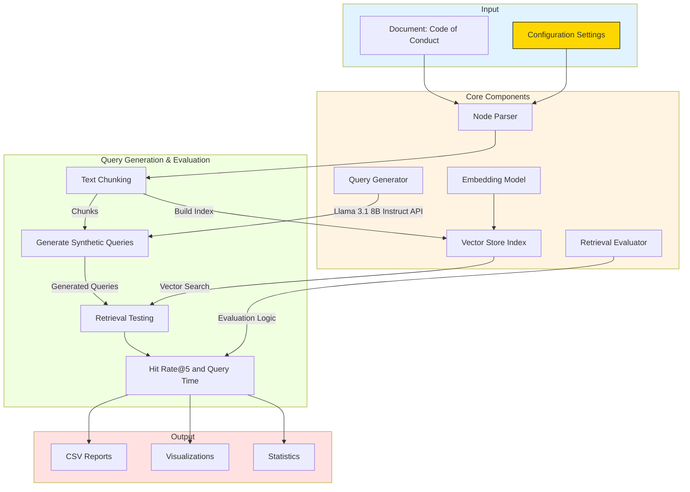

# Synthetic Query Generator for Document Retrieval

A tool for generating and evaluating synthetic search queries to test document retrieval systems. Particularly useful for testing enterprise search systems on internal documents like codes of conduct, policies, and procedures.

## Installation

```bash
pip install llama-index llama-index-embeddings-huggingface llama-index-llms-openai-like
```

Set your API credentials for OpenAI compatible endpoint:
```python
import os
os.environ["API_KEY"] = "your_api_key"
os.environ["BASE_URL"] = "your_api_base_url"
```

## Quick Start

```python
from retrieval_evaluator import EvalConfig, RetrievalEvaluator

# Configure the evaluator
config = EvalConfig(
    input_file="code_of_conduct.txt",
    model_path="/models/your-llm-model",
    chunk_size=50,  # Size of text chunks
    chunk_overlap=20,  # Overlap between chunks
    queries_per_chunk=1  # Number of queries per chunk
)

# Create and run evaluator
evaluator = RetrievalEvaluator(config)
results = evaluator.run_evaluation()
```

## Mermaid plot




## Example: Testing Code of Conduct Retrieval

Input data is (publicly) downloaded and converted to markdown (txt) as `text.txt`:

```python
# Load and process a code of conduct document
config = EvalConfig(
    input_file="text.txt",
    model_path="/models/llama-3.1-instruct", # update for model
    max_input_tokens=1000
)

evaluator = RetrievalEvaluator(config)

# Run evaluation
results = evaluator.run_evaluation()

# Results include:
# - Hit@k metrics
# - Average retrieval time
# - Generated queries
# - Original chunks
# - Processing statistics
```

## Key Features

- Chunk large documents into processable segments
- Generate natural language queries using LLMs
- Test retrieval accuracy with hit@k metrics
- Evaluate retrieval speed and performance
- Generate detailed CSV reports and visualizations

## Output Files

After running the evaluation, the following files are generated in the `output` directory:

- `hit_queries.csv`: Contains queries and their retrieval success
- `original_chunks.csv`: Original text chunks
- `retrieval_times.csv`: Performance metrics
- `stats.csv`: Overall evaluation statistics

## Configuration Options

```python
config = EvalConfig(
    # Required
    input_file="document.txt",
    model_path="/path/to/model",
    
    # Optional with defaults
    chunk_size=50,
    chunk_overlap=20,
    query_temperature=0.2,
    queries_per_chunk=1,
    max_input_tokens=1152,
    token_buffer=100,
    top_k=5,
    batch_size=10,
    debug=True
)
```

## Understanding Results

The system provides several metrics:

```python
# Sample results interpretation
print(f"Overall Hit@{config.top_k}: {results['hit_at_k_mean']:.3f}")
print(f"Average retrieval time: {results['avg_retrieval_time']:.3f} seconds")
print(f"Processed chunks: {results['processed_chunks']}")
print(f"Successful queries: {results['successful_queries']}")
print(f"Max tokens seen: {self.stats['token_stats']['max_seen']}")
print(f"Average tokens: {self.stats['token_stats']['average']:.1f}")
```

Results for `sentence-transformers/all-mpnet-base-v2`:

```
Evaluation Statistics:
Overall Hit@5: 0.791
Average retrieval time: 0.845 seconds

Processing Statistics:
Processed chunks: 220
Skipped chunks: 0
Successful queries: 220
Failed queries: 0

Token Statistics:
Max tokens seen: 191
Average tokens: 505.5
```

## Error Handling

The system includes robust error handling and debugging:

```python
try:
    results = evaluator.run_evaluation()
except ProcessingError as e:
    print(f"Processing error: {e}")
    # Access detailed error stats
    print(evaluator.stats['errors'])
```

## License

MIT License
